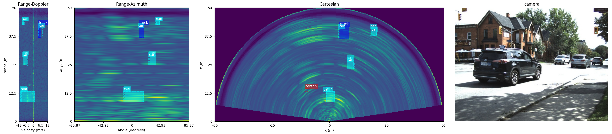

# Automotive-radar-object-detection
Estimate speed, distance and angle of objects Based on Range Doppler spectrum and Range azimuth spectrum which obtained after Fourier transformation of radar signal.
 

> [!NOTE]  
> Full implementation is kept private, But you can look up at data preprocessing, visualization and model preformance attached in [Source/automotive-radar-object-detection.ipynb](https://github.com/AhmedAchraf2001/Automotive-radar-object-detection/blob/main/Source/automotive-radar-object-detection.ipynb) file.

 
 

### Why radar compared to cameras and lidars?
The radar offers additional insights alongside the lidar and camera. 
**Radar operates effectively in various weather and lighting conditions**, such as darkness, fog, or snow.
Radars are precisely measuring **distance, speed, and the arrival angle** of surrounding objects. 
Radars outperform other methods in speed estimation while **requiring lower computational and memory cost.**

 

## 

<h6 align="center"> 
 
 [image](https://github.com/ZhangAoCanada/RADDet/blob/main/images/testset_samples.png) 

</h6>

 

|     	                  |Range-Doppler Spectrum      |Range-azimuth spectrum       |
|---------------------------------------|-------------------------------------------------|---------------------------------------------------------|
|Obtain Spectra from radar signal After |**Two successive Fourier transforms**   *First image|**Three successive Fourier transforms**    *Second image|
|vehicle's environment                  | is represented based on:  -	**Distance**    -	**Speed of each target** | is represented based on:  - **Distance**    - **Angle of arrival**  |

 

## Estimation of distance, speed, and angle from spectra
By a bounding box on spectra these parameters could be estimated:
- **Extract the position (x, y) of bounding box**
  -	**x = range**
  -	**y = speed or angle**

then estimate those parameter using x, y and radar resoluation, equations attached below.

 
 

## Progress
### [2024-04-24] Update model archietecture, Use pytorch for more flexibilty while dealing with `.npy`, `.pickle` and 'stereo image' files, 100% acc reached on validation set, Check [Source/training metrics.json](https://github.com/AhmedAchraf2001/Automotive-radar-object-detection/blob/main/Source/training%20metrics.json).
### [2024-04-15] Download a small portion of data, apply preprocessing, and build a primary model to experiment the data.
### [2024-04-06] Find more resources about data description and how data is collected and constructed, read the attached papers [Docs/papers](https://github.com/AhmedAchraf2001/Automotive-radar-object-detection/tree/main/Docs/papers)
### [2024-04-02] Project planning, defining requirements and priorities, and specifying the form of outputs.

 

## My Contribuation
RNN-CNN Archeticheture has implemented to track the object on radar to specify many parameter like object is moving towards or away from car and detect object on spectra easily wheter it diffcult to specify where is the object using only on frame so i will implement rnn cnn model like human activity recognation.

 

## TO DO
- [x] Use detectron2 to build various models.
- [ ] Implement 3D object detector on Range-Doppler-Angle Tensor.
- [ ] Study this [article](https://www.plextek.com/a-programmers-introduction-to-processing-imaging-radar-data/) well, to implement object detector on cartesian space.

 

## References
Ao Zhang1, Farzan Erlik Nowruzi1, Robert Laganiere, 'RADDet: Range-Azimuth-Doppler based Radar Object Detection for Dynamic Road Users' vol. 39, no. 10, 2020. 
[https://doi.org/10.48550/arXiv.2105.00363](https://arxiv.org/abs/2105.00363)

